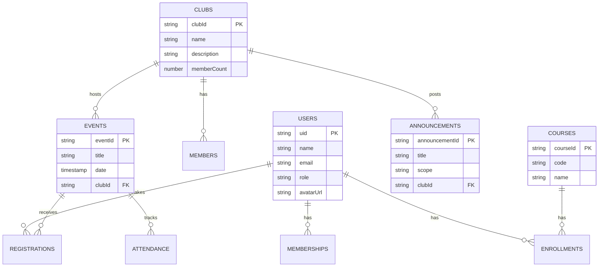

# Firestore Database Schema Design

This document outlines the Firestore NoSQL database structure for the UniSphere application. The design prioritizes scalability, real-time updates, and efficient querying patterns suitable for a university campus app.

## Data Requirements List

Based on the application's domain models (`models/` directory), the following data entities and relationships are required:

1.  **Users**: Students, Club Admins, and Super Admins. Crucial for authentication, profiles, and role management.
2.  **Clubs**: Student organizations with details, membership lists, and administrative privileges.
3.  **Events**: Activities hosted by clubs or the university, requiring details like time, venue, and capacity.
4.  **Registrations**: User sign-ups for specific events, tracking status (registered/waitlisted/cancelled).
5.  **Announcements**: News updates, either campus-wide or specific to a club.
6.  **Academic Records**: information about courses, grades, and enrollments per student.
7.  **Attendance**: Records of students checking in to events.

---

## Firestore Schema

### 1. `users` Collection
Stores user profiles and global settings.

*   **Collection Path:** `users`
*   **Document ID:** Authentication UID (from Firebase Auth)

| Field | Type | Description |
| :--- | :--- | :--- |
| `uid` | String | Unique User ID (PK) |
| `name` | String | ongoing Display name |
| `email` | String | User email address |
| `role` | String | 'student', 'clubAdmin', 'superAdmin' |
| `avatarUrl` | String | URL to profile picture (optional) |
| `createdAt` | Timestamp | Account creation date |
| `updatedAt` | Timestamp | Last profile update |

#### Subcollection: `users/{userId}/memberships`
Tracks which clubs a user has joined.

| Field | Type | Description |
| :--- | :--- | :--- |
| `clubId` | String | Reference to club ID (Document ID) |
| `role` | String | 'member', 'admin' |
| `joinedAt` | Timestamp | Date joined |

#### Subcollection: `users/{userId}/enrollments`
Tracks academic courses a user is taking.

| Field | Type | Description |
| :--- | :--- | :--- |
| `courseId` | String | Reference to course ID (Document ID) |
| `grade` | String | Current grade (e.g., 'A', 'B+') |
| `status` | String | 'enrolled', 'completed', 'dropped' |

---

### 2. `clubs` Collection
Stores information about student organizations.

*   **Collection Path:** `clubs`
*   **Document ID:** Auto-generated ID

| Field | Type | Description |
| :--- | :--- | :--- |
| `name` | String | Club name |
| `description` | String | Brief description |
| `logoUrl` | String | URL to club logo |
| `memberCount` | Number | Aggregated count of members |
| `createdAt` | Timestamp | Club creation date |

#### Subcollection: `clubs/{clubId}/members`
Redundant relationship store for efficient "get all members of club X" queries.

| Field | Type | Description |
| :--- | :--- | :--- |
| `userId` | String | Reference to user ID (Document ID) |
| `joinedAt` | Timestamp | Date joined |
| `role` | String | 'member', 'admin' |

---

### 3. `events` Collection
Stores event details. Kept top-level for global "Upcoming Events" queries.

*   **Collection Path:** `events`
*   **Document ID:** Auto-generated ID

| Field | Type | Description |
| :--- | :--- | :--- |
| `title` | String | Event title |
| `description` | String | Event details |
| `date` | Timestamp | Date and time of the event |
| `location` | String | Venue name or coordinates |
| `clubId` | String | Reference to hosting club |
| `clubName` | String | Denormalized club name to avoid extra reads |
| `capacity` | Number | Max participants |
| `registeredCount` | Number | Current number of registrations |
| `status` | String | 'published', 'draft', 'cancelled' |
| `createdBy` | String | User ID of the creator |

#### Subcollection: `events/{eventId}/registrations`
Tracks users who have signed up for an event.

| Field | Type | Description |
| :--- | :--- | :--- |
| `userId` | String | Reference to user ID (Document ID) |
| `registeredAt` | Timestamp | Date time of registration |
| `status` | String | 'confirmed', 'waitlisted', 'cancelled' |

#### Subcollection: `events/{eventId}/attendance`
Tracks actual check-ins.

| Field | Type | Description |
| :--- | :--- | :--- |
| `userId` | String | Reference to user ID (Document ID) |
| `checkInTime` | Timestamp | Exact time of check-in |
| `method` | String | 'qr', 'manual', 'nfc' |

---

### 4. `announcements` Collection
Stores news and updates.

*   **Collection Path:** `announcements`
*   **Document ID:** Auto-generated ID

| Field | Type | Description |
| :--- | :--- | :--- |
| `title` | String | Headline |
| `content` | String | Body text |
| `scope` | String | 'campus', 'club' |
| `clubId` | String | Reference to club (if scope is club) |
| `authorId` | String | User ID of the poster |
| `priority` | String | 'normal', 'high', 'urgent' |
| `createdAt` | Timestamp | Posting time |

---

### 5. `courses` Collection
Catalog of available academic courses.

*   **Collection Path:** `courses`
*   **Document ID:** Auto-generated ID

| Field | Type | Description |
| :--- | :--- | :--- |
| `code` | String | Course code (e.g., 'CS101') |
| `name` | String | Full course name |
| `instructor` | String | Name of the professor |
| `credits` | Number | Credit hours |
| `schedule` | String | e.g., "Mon/Wed 10:00 AM" |

---

## Visual Schema Diagram



## Sample JSON Documents

### User Document (`users/user123`)
```json
{
  "uid": "user123",
  "name": "Jane Doe",
  "email": "jane.doe@university.edu",
  "role": "student",
  "avatarUrl": "https://example.com/avatars/jane.jpg",
  "createdAt": "2023-10-01T08:00:00Z",
  "updatedAt": "2023-10-15T14:30:00Z"
}
```

### Event Document (`events/event999`)
```json
{
  "title": "Flutter Workshop 2024",
  "description": "Learn the basics of Flutter and Firebase.",
  "date": "2024-03-20T10:00:00Z",
  "location": "Room 304, Engineering Building",
  "clubId": "club_tech_society",
  "clubName": "Tech Society",
  "capacity": 50,
  "registeredCount": 42,
  "status": "published",
  "createdBy": "user_admin_01"
}
```

### Registration Subcollection (`events/event999/registrations/user123`)
```json
{
  "userId": "user123",
  "registeredAt": "2024-03-10T09:15:00Z",
  "status": "confirmed"
}
```

## Reflection

### Design Choices
1.  **Subcollections for Scalability**: Instead of storing arrays of IDs (like `memberIds` in `ClubModel`), I used subcollections. Arrays in Firestore documents are limited by the 1MB document size limit. A popular club with thousands of members would break a single document. Subcollections (`clubs/{id}/members`) solve this and allow query pagination.
2.  **Denormalization**: In the `events` collection, I included `clubName`. This duplicates data slightly, but it avoids an extra read (fetching the club document) every time we display a list of events. This improves read performance, which is typically much higher volume than write performance.
3.  **Top-Level Collections**: `events` and `announcements` are top-level collections rather than subcollections of `clubs`. This is because a primary use case is "Show me all events happening on campus today" regardless of which club hosts them. A Collection Group query could work on subcollections, but top-level collections are often simpler for global feeds.
4.  **Separation of Concerns**: User data, academic records, and social activities are kept in distinct collections to maintain logical separation and data hygiene.

### Challenges
*   **Balancing Relational Data in NoSQL**: Deciding between referencing IDs (requiring joins/multiple reads) vs. duplicating data (requiring multiple updates) is always a tradeoff. I chose to duplicate static-ish data like `clubName` in `events` but kept dynamic data like `registrations` fully normalized in subcollections.
*   **Mapping Dart Models**: The existing Dart models used `List<String>` for relationships, which is convenient for small apps (in-memory) but bad for database scalability. Moving to subcollections requires changing how the frontend retrieves this data (using Streams or paginated queries instead of property access).
